# Subtrack

An Android and iOS app, with a website on the same API, for keeping track of your subscriptions: what you pay for, how much it costs per month and per year, and when each one renews.

[](https://github.com/Malikalqasrawi/subtrack/actions/workflows/ci.yml)


[](LICENSE)

## Why

Subscriptions are easy to start and easy to forget. The charges are small, they land on different days, some are yearly, and a few are in another currency, so the real monthly total is rarely known. Subtrack answers three questions in one place:

- **What does it all cost?** Every subscription is turned into a monthly figure in one currency, whatever its billing cycle or currency.
- **What is charged when?** The dashboard shows what will actually be billed in each of the next 12 months, and the calendar shows it day by day.
- **What is about to renew?** A reminder email arrives a chosen number of days before, once per renewal, in time to cancel.

## Features

- **Dashboard** with monthly and yearly spend, charges for the next 12 months, spend by category, and renewals in the next 30 days
- **Subscriptions** with search, status filter, add, edit and delete
- **Calendar** showing which subscription charges on which day
- **Multi-currency**: each subscription keeps its own currency and totals are converted to your default currency
- **Email reminders** a chosen number of days before a renewal
- **Accounts** with email verification by 6-digit code, forgotten-password reset, optional two-factor authentication, and sign-in with Google or Apple
- **Account settings** to change your name, phone number, email and password, or delete the account

| Layer | Technology |
|---|---|
| Mobile app | React Native 0.86, Expo 57, TypeScript, Expo Router, TanStack Query |
| Website | React 19, TypeScript, Vite, React Router, TanStack Query, Motion, Recharts |
| Backend | Java 21, Spring Boot 4 (Web MVC, Security, Data JPA, Validation, Mail) |
| Database | PostgreSQL 17, schema managed by Flyway |
| Packaging | Docker Compose (nginx, backend, PostgreSQL, Mailpit) |

## Screenshots

### Mobile app

| Dashboard | Spending | Subscriptions |
|---|---|---|
| 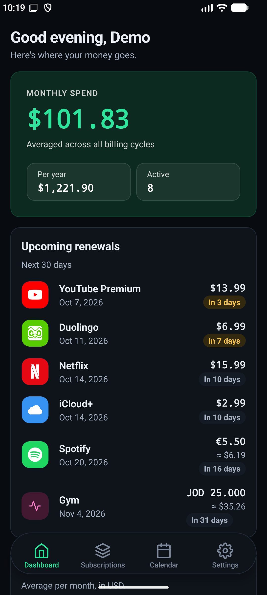 | 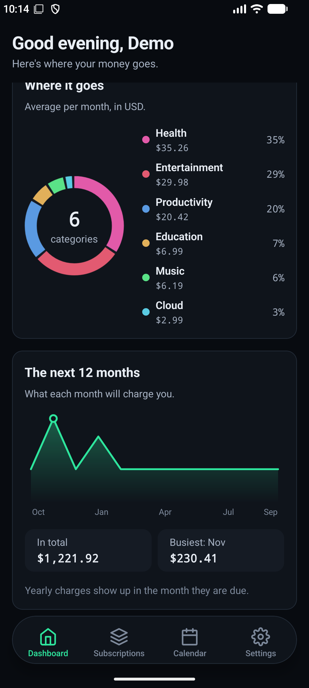 | 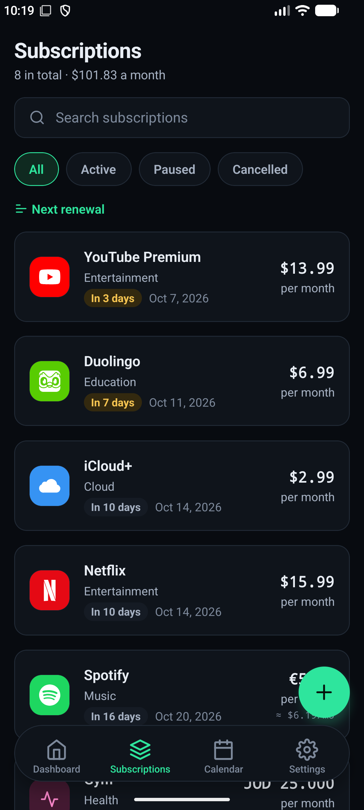 |

| Subscription details | Calendar | Light mode |
|---|---|---|
| 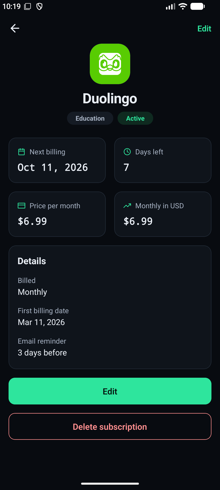 | 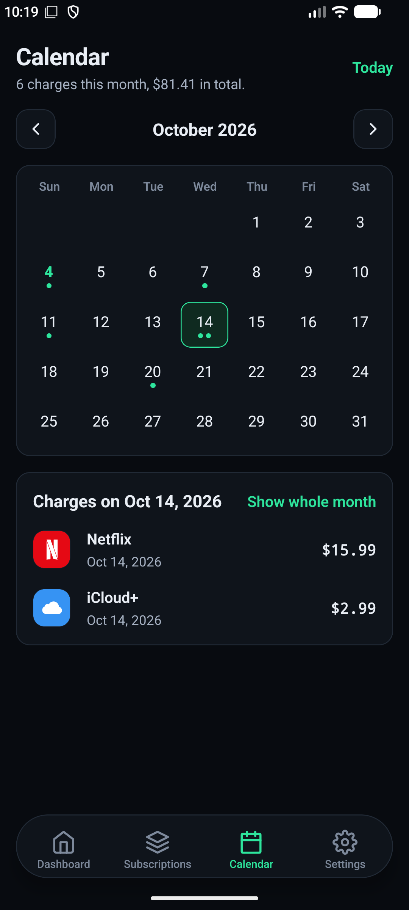 | 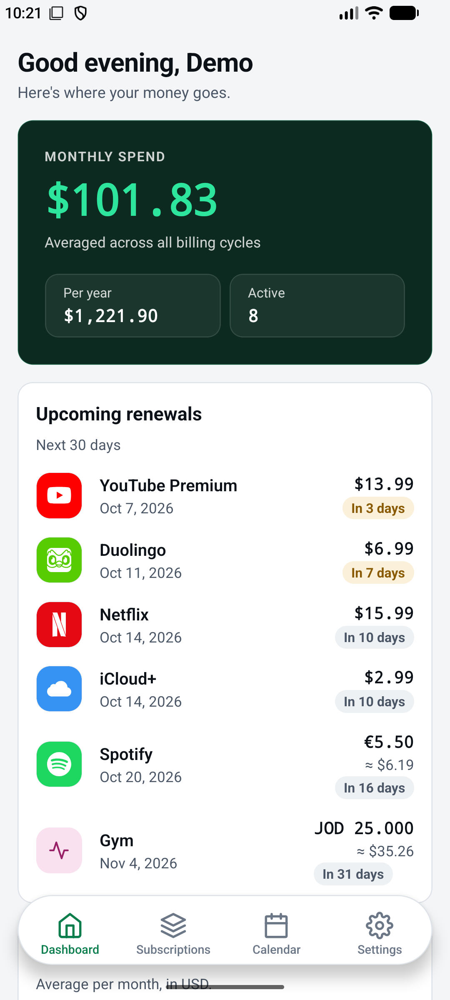 |

### Website

| Dashboard | Subscriptions | Add subscription |
|---|---|---|
| 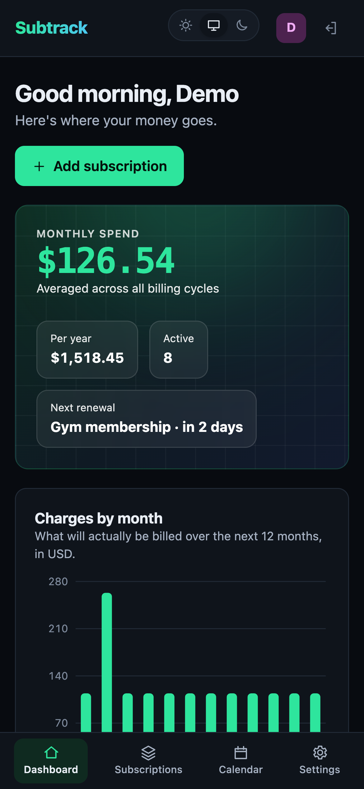 | 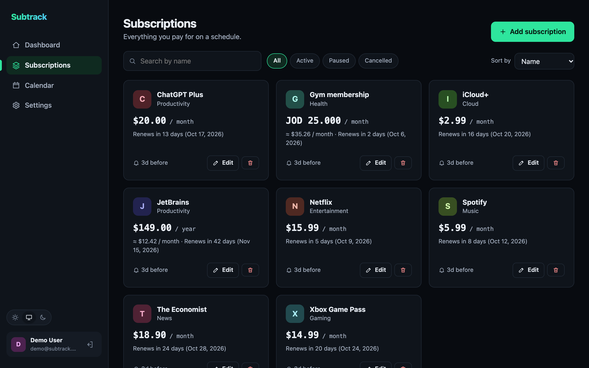 | 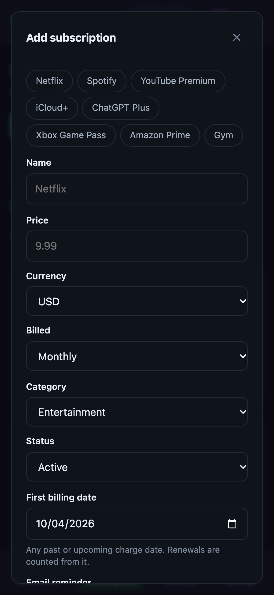 |

| Calendar | Light mode | Sign in |
|---|---|---|
| 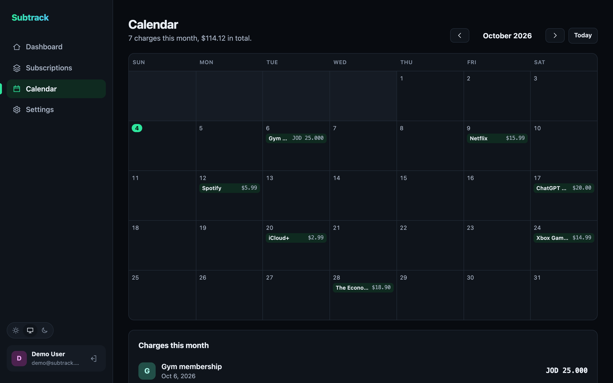 | 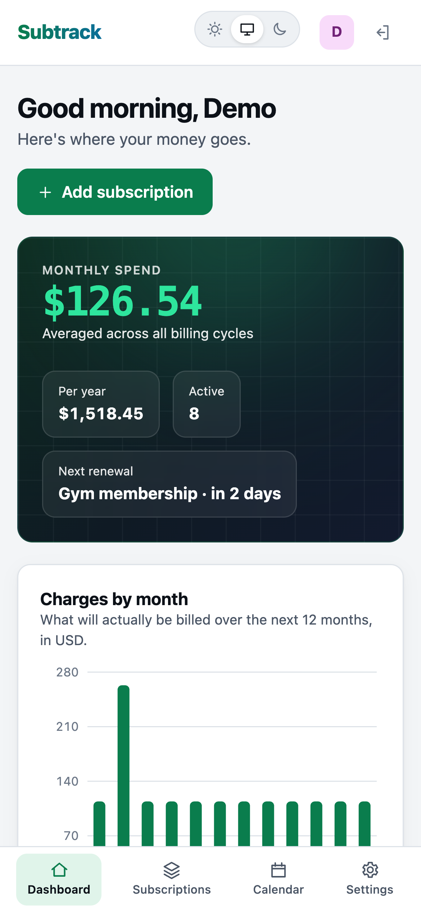 | 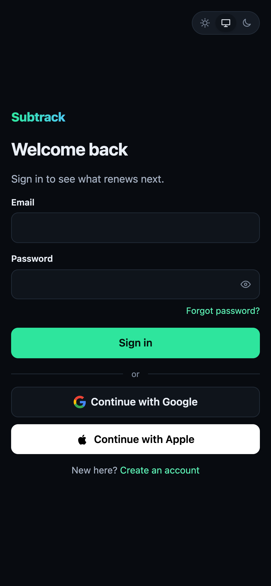 |

## Project structure

```
subtrack/
├── backend/               Spring Boot API
│   └── src/main/java/com/subtrack/   one package per feature (see Backend packages)
├── mobile/                React Native app (Expo)
│   └── src/
│       ├── api/           fetch client, endpoints, types
│       ├── app/           one file per screen (Expo Router)
│       ├── appearance/    light, dark or the phone's own setting
│       ├── components/    shared UI, charts, the settings sections
│       ├── lib/           data hooks (TanStack Query), formatting, service logos
│       └── session/       the signed-in user and stored tokens
├── frontend/              React website
│   └── src/
│       ├── api/           fetch client, endpoints, types
│       ├── auth/          session context
│       ├── components/    shared UI and the settings sections
│       ├── lib/           data hooks (TanStack Query), formatting, theme
│       └── pages/         one file per screen
├── docs/screenshots/
├── scripts/git-hooks/     pre-commit hook that blocks secrets
├── docker-compose.yml     nginx, backend, PostgreSQL, Mailpit
└── .env.example           copy to .env and fill in
```

## Quick start with Docker

You need Docker with the Compose plugin.

```bash
cp .env.example .env
# Edit .env: set DB_PASSWORD and DB_APP_PASSWORD, each to the output of:
openssl rand -hex 24
# JWT_SECRET to the output of:
openssl rand -base64 48
# and ENCRYPTION_KEY to the output of:
openssl rand -base64 32

docker compose up --build
```

| URL | What |
|---|---|
| http://localhost:3000 | The app |
| http://localhost:8025 | Mailpit, an inbox that catches every email the app sends |

Create an account, then open Mailpit to read the verification code.

To send real email instead, set the `MAIL_*` variables in `.env` to your SMTP provider (see `.env.example`).

## Mobile app

The app talks to the same API as the website, so start the Docker stack first. You need Node 22 and an Android emulator or a phone with [Expo Go](https://expo.dev/go).

```bash
docker compose up -d
cd mobile
npm install
cp .env.example .env
npx expo start --android --port 8082
```

Port 8082 is used because the backend container already holds 8081, the Expo default.

`EXPO_PUBLIC_API_URL` in `.env` is where the app finds the API. The default, `http://10.0.2.2:3000`, is how an Android emulator reaches the computer it runs on. For a real phone, set it to your computer's address on the same Wi-Fi, for example `http://192.168.1.20:3000`, and set `APP_BIND=0.0.0.0` in the root `.env`: by default the app answers on your own machine only.

The app has sign-in with the two-factor step, sign-up with email verification, password reset, the dashboard with charts, subscriptions with search, filters and sorting, a details screen, the calendar and account settings. It follows the phone's light or dark setting, or the one chosen under Settings → Appearance. Known services such as Netflix or Spotify get their logo ([Simple Icons](https://simpleicons.org), CC0), matched by name.

### Google sign-in in the app

Google sign-in uses native code, so it does not work in Expo Go: the button answers that it needs the installed app. To try it, build the app once (needs JDK 17 or 21 and the Android SDK):

```bash
cd mobile
npx expo run:android --port 8082
```

It also needs two OAuth clients in the same Google Cloud project:

1. The **Web application** client from [Sign in with Google and Apple](#sign-in-with-google-and-apple). Put its client id in `mobile/.env` as `EXPO_PUBLIC_GOOGLE_WEB_CLIENT_ID`, the same value as `GOOGLE_CLIENT_ID` in the root `.env`.
2. An **Android** client with the package name `com.malik.subtrack` and the SHA-1 fingerprint of the key the build is signed with. For a debug build:

```bash
keytool -list -v -keystore mobile/android/app/debug.keystore -storepass android
```

The Android client's id is not used anywhere. It only has to exist, so Google accepts requests from this app. The app receives an ID token issued for the web client and sends it to `POST /api/auth/google`, the same endpoint the website uses.

## Sign in with Google and Apple

Both buttons are always shown. Until a provider's client id is set, its button explains that it is not set up. Each provider is switched on by one variable in `.env`, followed by `docker compose up -d`.

### Google

1. Open the [Google Cloud Console](https://console.cloud.google.com/apis/credentials) and create a project.
2. Configure the OAuth consent screen (External, with your app name and email).
3. Create credentials → OAuth client ID → Web application.
4. Under **Authorised JavaScript origins** add every address the app is opened from, for example `http://localhost:3000` and `http://localhost:5173`.
5. Put the client id in `.env`:

```bash
GOOGLE_CLIENT_ID=1234567890-abc.apps.googleusercontent.com
```

Google sign-in works on `localhost` without HTTPS.

### Apple

Apple needs a paid Apple Developer account, and it does not allow `localhost`: the app has to be served from a real domain over HTTPS.

1. In [Certificates, Identifiers & Profiles](https://developer.apple.com/account/resources/identifiers/list) create an **App ID** with Sign in with Apple enabled.
2. Create a **Services ID** (for example `com.yourdomain.subtrack.web`), enable Sign in with Apple on it, and add your domain and `https://yourdomain.com` as a return URL.
3. Put the Services ID in `.env`:

```bash
APPLE_CLIENT_ID=com.yourdomain.subtrack.web
```

### How it works

The browser gets an ID token from the provider and sends it to the backend. The backend checks the token's signature against the provider's published keys, and that it was issued for this app and has not expired, before trusting anything in it. A first sign-in creates an account; later sign-ins find it by the provider's permanent id. If an account with the same verified email already exists, the two are linked.

## Local development

The quickest way is to keep the Docker stack running and start only the frontend with live reload. The backend container is published on port 8081, and the Vite dev server proxies `/api` to it.

```bash
docker compose up -d
cd frontend
npm install
npm run dev        # http://localhost:5173
```

To run the backend on your machine as well (needs JDK 21 or newer), stop its container first so port 8081 is free:

```bash
docker compose stop backend
cd backend
PORT=8081 DB_PASSWORD=<the value from .env> ./mvnw spring-boot:run -Dspring-boot.run.profiles=dev
```

The `dev` profile uses a built-in development JWT secret and prints emails (including verification codes) to the backend console instead of sending them. Set `MAIL_MODE=smtp` to send them to Mailpit instead.

Because of that proxy the browser sees a single origin, exactly as it does behind nginx in Docker. That is why the project has no CORS configuration.

### Tests

```bash
cd backend && ./mvnw test
cd frontend && npm run lint && npm test && npm run build
cd mobile && npm run lint && npm run typecheck && npm test
```

130 backend tests, 43 frontend tests and 215 mobile tests. They need no mail server or Google account. The backend tests need Docker: they start a throwaway PostgreSQL 17 (Testcontainers; Colima is picked up by itself) and connect to it the way the deployed application does. The frontend and mobile tests replace the API.

| Backend test | Covers |
|---|---|
| `ApiIntegrationTest` | End-to-end over HTTP: sign-up and verification, password rules, password reset, two-factor sign-in, lockouts per network address, token versions and sign-out everywhere, email and password changes, the emailed code that accounts without a password confirm them with, security alerts, limits on emailed codes, clean-up of unverified sign-ups, account deletion, token rotation, per-user data isolation, insights, reminders |
| `LoginGuardTest` | Lockout per network address, the account-wide backstop, counts that expire or reset |
| `SecretBoxTest` | AES-GCM encryption of stored secrets, older plain values, a wrong key or changed data, a missing key |
| `ProductionChecksTest` | Production mode refusing codes in the log and an insecure cookie |
| `SubscriptionRowSecurityTest` | Row level security: no rows without a user, only the user's own rows from a query with no filter, another user's row cannot be read, changed, deleted, created or taken over, scheduled jobs and account deletion still work |
| `ApplicationRoleTest` | The application's database login: not a superuser and not the owner, reads and writes rows, cannot change the schema, create logins or run server programs |
| `TotpAuthenticatorTest` | Authenticator codes against the RFC 6238 test values, one step of clock drift, used and wrong codes, Base32 secrets |
| `SocialLoginServiceTest` | Google and Apple sign-in: new accounts, linking by verified email, unverified sign-ups |
| `StrongPasswordValidatorTest` | The password policy |
| `BillingCycleTest` | Billing-date arithmetic for weekly, monthly, quarterly and yearly cycles, including month ends |
| `SubscriptionReminderTest` | When a renewal needs a reminder, and that it is sent once |
| `EmailOutboxTest` | An email from hand-over to the mail server: sent after commit, nothing sent after a rollback, encrypted while it waits, retried with growing waits, given up on after the fifth attempt, old ones deleted |
| `EmailLayoutTest` | The HTML version of an email: the code box, the inbox preview, text from a user escaped |
| `SmtpMailTransportTest` | Every email carries a plain-text and an HTML version |
| `RateLimitFilterTest` | A bucket per client, `429` once it is empty, the first matching rule, rules that share a bucket, paths without a rule |
| `ShippedRateLimitRulesTest` | The rules in `application.yml`: every request that sends an email falls under the hourly limit |
| `EmailedCodeBudgetTest` | Sign-ups with unconfirmed addresses cannot use up the codes of confirmed accounts |
| `CachingExchangeRateProviderTest` | Cached rates, refresh after expiry, falling back when the rate service is down |

| Frontend test | Covers |
|---|---|
| `client.test.ts` | The access token header, renewing an expired session once and repeating the request, one shared refresh, error answers |
| `queries.test.tsx` | Deleting before the server answers and putting the card back if it refuses, create and update, refreshing the totals |
| `SubscriptionForm.test.tsx` | Popular-service presets, the request that is sent, editing, server field errors, closing with Escape |
| `LoginPage.test.tsx` | Sign-in, the two-factor step, an expired challenge, a locked account, unverified accounts |
| `OwnerCode.test.tsx` | Accounts without a password confirming a new password, an email change, two-factor setup and deletion with an emailed code; accounts with a password still using it |
| `format.test.ts`, `password.test.ts`, `errors.test.ts` | Dates and relative days, the password rules and phone format, error messages |

| Mobile test | Covers |
|---|---|
| `*-screen.test.tsx`, `settings-security.test.tsx` | Each screen against a replaced API: sign-in with the two-factor step, sign-up, verification, password reset, dashboard, subscriptions list and details, calendar, settings |
| `subscription-form.test.tsx`, `subscription-form.test.ts` | The add and edit form, the request that is sent, field errors |
| `google-sign-in.test.ts` | The ID token from Google's account picker, a closed picker, a missing client id, missing Play services |
| `session-context.test.tsx` | Stored sessions, sign-in, sign-out, a session that has ended |
| `appearance-*.test.ts(x)` | The saved theme choice and following the phone |
| `subscription-list.test.ts`, `calendar.test.ts`, `charts.test.ts`, `brands.test.ts` | Search, filter and sort, month grids, chart geometry, matching a name to a logo |
| `format.test.ts`, `password.test.ts`, `email.test.ts`, `errors.test.ts` | Dates and money, the password rules, email format, error messages |

CI runs a gitleaks secret scan, all three test suites and a Docker Compose smoke test on every push and pull request, with actions pinned to commits and a read-only token.

## Configuration

All settings are environment variables read by the backend. Defaults live in `backend/src/main/resources/application.yml`.

| Variable | Default | Purpose |
|---|---|---|
| `JWT_SECRET` | none, required | Signs access tokens. At least 32 characters. The app will not start without it. |
| `ENCRYPTION_KEY` | none, required | 32 random bytes in Base64. Encrypts two-factor secrets. Keep it: with another key, two-factor sign-ins stop working. |
| `PRODUCTION` | `false` | `true` on a real server: refuses to start unless `MAIL_MODE` is `smtp` and `COOKIE_SECURE` is `true` |
| `DB_URL`, `DB_USERNAME`, `DB_PASSWORD` | local `subtrack` database | PostgreSQL address, and the owner of the schema, used only to run the migrations |
| `DB_APP_USERNAME`, `DB_APP_PASSWORD` | `subtrack_app`, password required | The login the application uses for everything else. Created after the migrations with rights to read and write rows only |
| `MAIL_MODE` | `smtp` | `smtp` sends email, `log` prints it to the console |
| `MAIL_HOST`, `MAIL_PORT`, `MAIL_USERNAME`, `MAIL_PASSWORD`, `MAIL_SMTP_AUTH`, `MAIL_SMTP_STARTTLS` | Mailpit on `localhost:1025` | SMTP server |
| `MAIL_FROM` | `Subtrack <no-reply@subtrack.local>` | Sender address |
| `COOKIE_SECURE` | `false` | Set to `true` when serving over HTTPS |
| `APP_BIND` | `127.0.0.1` | Read by Docker Compose: the address port 3000 is published on. `0.0.0.0` opens the app to the network |
| `EXCHANGE_RATES_PROVIDER` | `remote` | `remote` fetches live rates, `fixed` uses the built-in table only |
| `GOOGLE_CLIENT_ID`, `APPLE_CLIENT_ID` | empty | Switch on sign-in with Google / Apple |

Token lifetimes, verification rules, the reminder schedule and rate limits are set under `app:` in `application.yml`.

## Architecture

```
browser ──► nginx (frontend container)
              ├─ /        static React bundle
              └─ /api/*   ──► Spring Boot ──► PostgreSQL
                                  ├──► SMTP (Mailpit or a real provider)
                                  └──► exchange-rate API
```

### Backend packages

The backend is organised by feature. Each package owns its entity, repository, service, controller and DTOs.

| Package | Responsibility |
|---|---|
| `auth` | Registration, email verification, sign-in, password reset, sessions and tokens |
| `auth.twofactor` | Authenticator-app codes (TOTP), recovery codes, the second sign-in step |
| `auth.social` | Verifying Google and Apple ID tokens and linking them to users |
| `user` | Profile, and the sensitive account changes: email, password, deletion |
| `subscription` | The subscription entity, billing-cycle arithmetic, CRUD |
| `insights` | Dashboard totals, 12-month projection, calendar |
| `reminder` | Daily job that sends renewal reminders |
| `currency` | Exchange rates and conversion |
| `mail` | The outbox every email goes through, retries, and the HTML layout |
| `ratelimit` | Request rate limiting |
| `common`, `config` | Base entity, error handling, security and bean configuration |

### Object-oriented design

Where each principle shows up in the code:

| Principle | Where |
|---|---|
| **Abstraction** | `BaseEntity` holds the id and timestamps every entity shares. `ApiException` is the abstract base of every error the API returns on purpose; the exception handler knows only that type. |
| **Encapsulation** | Entities have no setters. State changes go through methods that keep them valid: `User.markEmailVerified()`, `RefreshToken.revoke()`, `VerificationCode.registerFailedAttempt()`, `Subscription.markReminderSent()`. |
| **Polymorphism** | `BillingCycle` is an enum whose constants each implement `advance` and `wholePeriodsBetween`. Shared logic such as `nextOccurrenceOnOrAfter` is written once against those two operations. `GoogleTokenVerifier` and `AppleTokenVerifier` extend the abstract `OidcTokenVerifier`, which holds everything the two providers share. `SignInResult` is a sealed interface with two cases, so the compiler forces every caller to handle "second factor still needed". |
| **Interfaces to reduce coupling** | Services depend on `EmailSender`, `MailTransport`, `ExchangeRateProvider`, `RateLimiter`, `AccessTokenService`, `TwoFactorChallengeService`, `IdentityTokenVerifier`, `CodeGenerator` and `NotificationChannel`, never on SMTP, HTTP, Bucket4j, JWT or Google directly. The tests swap in a recording `EmailSender` and a fake `IdentityTokenVerifier` without touching production code. |
| **Open/closed** | A new reminder channel is a new `NotificationChannel` bean; `ReminderService` picks it up without changes. `CachingExchangeRateProvider` is a decorator that adds caching and fallback to any provider. A new billing cycle is a new enum constant. A new sign-in provider is a new `IdentityTokenVerifier`. The password policy is one annotation, `@StrongPassword`, reused wherever a password is accepted. A new rate limit is a new entry in `application.yml`. |

### API

All endpoints are under `/api`. Everything except `/api/auth/*` and `/api/public/*` requires `Authorization: Bearer <access token>`.

| Method and path | Purpose |
|---|---|
| `POST /auth/register` | Create an account and email a verification code |
| `POST /auth/verify` | Confirm the code (with email and password) and sign in |
| `POST /auth/resend-verification` | Send a new code |
| `POST /auth/login` | Sign in. Answers with a session, or with a challenge token if two-factor is on |
| `POST /auth/google`, `POST /auth/apple` | Sign in with a provider's ID token |
| `POST /auth/2fa` | Finish signing in with the challenge token and a code |
| `POST /auth/forgot-password` | Email a password-reset code |
| `POST /auth/reset-password` | Set a new password using that code |
| `POST /auth/refresh` | Exchange the refresh cookie for a new access token |
| `POST /auth/logout` | End the session |
| `GET /public/config` | Which sign-in providers are set up |
| `GET`, `PUT /users/me` | Read or update the profile (name, phone number, default currency) |
| `POST /users/me/password` | Change the password |
| `POST /users/me/email`, `POST /users/me/email/confirm` | Change the email, confirmed by a code sent to the new address |
| `POST /users/me/confirmation-code` | For an account without a password: email the code that confirms a sensitive change |
| `POST /users/me/logout-all` | End every session on every device |
| `DELETE /users/me` | Delete the account and everything in it |
| `POST /users/me/2fa/setup`, `/enable`, `/disable` | Manage two-factor authentication |
| `GET`, `POST /subscriptions` | List or create |
| `GET`, `PUT`, `DELETE /subscriptions/{id}` | Read, update or delete one |
| `GET /insights/summary` | Dashboard data |
| `GET /insights/calendar?year=&month=` | Charges in a month |
| `GET /currencies` | Supported currency codes |

Errors always have the same shape:

```json
{ "status": 400, "code": "VALIDATION_FAILED", "message": "Some fields are invalid",
  "fieldErrors": { "amount": "must be greater than or equal to 0.00" }, "timestamp": "..." }
```

## Design decisions

- **State lives in the entities.** Entities have no setters. Changes go through methods that keep them valid, such as `User.changePassword()`, which also ends every session and lifts a sign-in lock, or `Subscription.markReminderSent()`.
- **One monthly figure.** Each subscription keeps its own amount, currency and billing cycle (`BigDecimal`, `numeric(12, 2)`). `BillingCycle` turns any cycle into a monthly cost, and `CurrencyConverter` turns it into the user's default currency, so totals compare like with like.
- **Charges are projected, not averaged.** The 12-month chart and the calendar come from each subscription's actual renewal dates, so a yearly charge shows up in its month instead of being spread thin.
- **Exchange rates never block a page.** `CachingExchangeRateProvider` wraps the live provider: rates are cached for 12 hours, a stale value is served if the rate service is down, and a built-in table covers the first start without network.
- **Reminders are sent once.** The daily job records the renewal it reminded about in `last_reminder_for`, so a restart or a second run the same day sends nothing twice. The email is queued in the same transaction, so a mail server that is down delays it instead of losing it.
- **Email goes through an outbox.** `EmailSender` saves the message in the same transaction as the change that caused it, so nothing is emailed about a change that was rolled back. A dispatcher sends it right after the commit, on background threads, and tries again after 1, 5, 15 and 60 minutes if the mail server is down; after the fifth failed attempt it gives up. Every email has a plain-text version and an HTML version built from the same text.
- **Time is injected.** Services take a `Clock`, so deadlines, lockouts and cooldowns are tested with a clock the tests can move (`MutableClock`) instead of waiting.
- **The schema is owned by migrations.** Flyway applies versioned SQL files and Hibernate only validates against them (`ddl-auto: validate`), so the database never changes by surprise. Migrations run as the owner of the schema; the application itself connects with a second login that can only read and write rows, so no request can drop a table or create a database user.
- **One origin, no CORS.** nginx serves the React bundle and proxies `/api`, and the Vite dev server does the same, so the refresh cookie can be `SameSite=Strict` and no cross-origin rules exist to get wrong.
- **Server data is cached in the browser, not copied into state.** TanStack Query holds what the API returned. Saving or deleting a subscription updates the list at once and marks the dashboard and calendar as out of date; a delete that the server refuses is put back.
- **Secrets stay out of the repo.** Configuration comes from a git-ignored `.env`. A pre-commit hook (`git config core.hooksPath scripts/git-hooks`) blocks secret files, key-like strings and any value from `.env`, and CI scans every push with gitleaks.

## Security

- **Passwords** must be 8 to 72 characters with a letter, a number and a special character, and are hashed with BCrypt. Verification codes are hashed too.
- **Forgotten passwords** are reset with an emailed 6-digit code under the same expiry and attempt limits. A reset signs the account out everywhere.
- **Lockouts that cannot be used against the owner**: 5 wrong passwords or two-factor codes within 15 minutes lock the account only for the network address they came from, so the owner can still sign in from anywhere else. 30 wrong attempts in a row from any addresses lock it everywhere. Entering the password again does not reset the count for the code step, and a password reset lifts every lock. The answer is `429 ACCOUNT_LOCKED`.
- **Limits on emailed codes**: 10 attempts per hour for each kind of code (asking for a new code does not reset the count), 5 codes a day per account, and 10 requests an hour per network address for the three requests that send one (sign-up, resend, forgotten password). The whole app sends at most 100 codes an hour to confirmed accounts and 50 to addresses nobody has confirmed yet, so sign-ups with made-up addresses cannot use up the codes of real accounts or the mail provider's sending limit.
- **A copy of the database is not enough**: emailed codes and refresh tokens are stored as hashes, and two-factor secrets are encrypted with AES-256-GCM using `ENCRYPTION_KEY`, which never touches the database. Secrets saved before that are encrypted at startup. An email waiting in the outbox is encrypted the same way, because it can hold a code, and its text is erased once it is sent.
- **Nobody can hold on to someone else's email**: a sign-up that was never verified is replaced by a newer one for the same address, and deleted after 48 hours. Names are letters only, so they cannot carry a link.
- **Security alerts**: an email is sent when the password, the email address (to the old address) or two-factor authentication changes.
- **Two-factor authentication** is optional and uses an authenticator app (TOTP). A used code cannot be replayed, eight single-use recovery codes cover a lost phone, guesses are limited to 5 per account every 5 minutes, and it applies to Google and Apple sign-ins too.
- **Sensitive changes** (email, password, turning on two-factor, deleting the account) ask for the current password. An account created with Google or Apple has no password, so it confirms them with a 6-digit code emailed to its address instead; the code works once and falls under the same limits as the other codes. A new email only takes effect after a code sent to it is confirmed.
- **Email verification**: a 6-digit code that expires after 15 minutes, allows 5 wrong attempts, and can be resent once every 60 seconds. An account cannot sign in until it is verified.
- **No account discovery**: registering an email that already exists, resending a code, and asking for a password reset respond the same way whether or not the account exists, and take about the same time: emails are sent in the background and a request that sends nothing does the same hashing work. The owner of an address that is already registered is told by email instead, once a day at most. Sign-in gives one error for both a wrong password and an unknown email.
- **Emails to unconfirmed addresses** carry no text chosen by the person who signed up, so the app cannot be used to send someone else a message.
- **Browser headers**: a Content-Security-Policy that only allows the app's own scripts plus the Google and Apple sign-in SDKs, and `X-Frame-Options`, `X-Content-Type-Options`, `Referrer-Policy`, `Permissions-Policy` and `Strict-Transport-Security` on every response including static assets.
- **Sessions**: a 15-minute JWT access token held only in browser memory, plus a 14-day refresh token in an `HttpOnly`, `SameSite=Strict` cookie scoped to `/api/auth`. Refresh tokens are stored hashed, are single-use, and are rotated on every refresh. Reusing an old one ends all of that user's sessions. Every access token carries the user's token version: changing or resetting the password, "Sign out of all devices" and deleting the account make every earlier token stop working at once, without a blocklist.
- **Rate limiting** per client IP with a token bucket: 10 requests per minute on `/api/auth/*`, 10 per hour on the requests that send an email, 120 per minute on the rest of the API. Over the limit, the API answers `429` with a `Retry-After` header.
- **Data isolation**: every subscription query filters by the signed-in user's id, so another user's id returns `404`. Behind that, PostgreSQL row level security on the subscriptions table shows the application only the rows of the user a transaction was opened for, so a query that forgot the filter would return nothing instead of everyone's data.
- **Input validation** on every request body, and JPA parameter binding throughout, so there is no string-built SQL.

Before putting this on the internet: serve it over HTTPS, set `COOKIE_SECURE=true` and `PRODUCTION=true`, use a real SMTP provider, and do not publish the database port.

## Known limits

- Rate-limit counters live in the backend's memory. With more than one backend instance, replace `InMemoryRateLimiter` with an implementation of `RateLimiter` backed by a shared store such as Redis. The same applies to the reminder job, which would need a lock so only one instance sends.
- "Today" is the server's UTC date, so a renewal can appear a day early or late for users far from UTC.
- The per-address sign-in counts live in the backend's memory, like the rate limits, and reset on restart.
- The phone number is stored but not verified by SMS, which would need a paid SMS provider.
- Google sign-in has been run against Google from the website and the Android app. Apple sign-in is covered by tests with a stand-in verifier only, because the real one needs a paid developer account.
- Categories are a fixed list.

## Author

Malik · Faculty of IT, Applied Science Private University, Amman

## License

[MIT](LICENSE)
